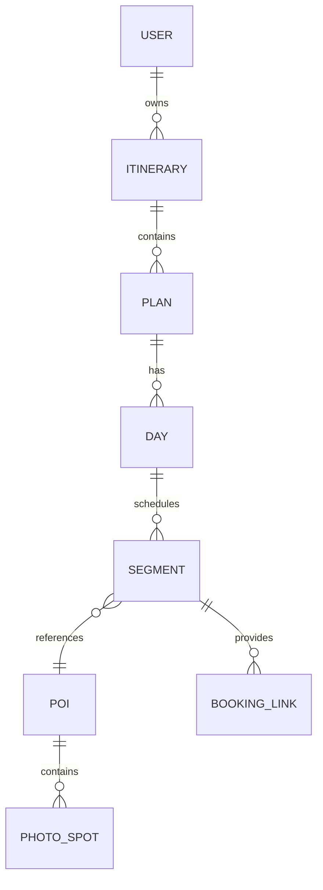

# trip_xuxiake

徐霞客 AI 旅行助手是一个面向「规划—预订—出行」全流程的旅行软件原型。当前仓库提供无后端依赖的 Web MVP：用户只输入出发地、旅行天数、预算档位、同行人和点选式旅行偏好，由系统推荐 2～3 个目的地方案，横向切换比较后保存到「我的行程」，并继续编辑地点顺序、删除/新增行程项、查看预订链接和启动旅中导航翻译助手。

## 已实现功能

- **目的地由系统推荐**：规划表单不再要求用户填写目的地；目的地由大模型接口返回，或在本地预览模式中根据偏好标签进行透明后备推荐。
- **点选式偏好**：旅行偏好改为 OTA/攻略平台常见标签，包括海岛沙滩、摄影打卡、美食夜市、文化古迹、自然奇观、亲子友好、户外徒步、城市漫游、温泉疗愈和小众避世。
- **大模型优先**：表单支持填写 `POST /api/ai/itineraries` 类大模型规划接口；接口不可用或未配置时，页面会明确提示并切换到本地预览后备，而不是假装拿到了实时数据。
- **多方案切换**：方案区使用横向滚动 Carousel 和 Tab 按钮，可模拟移动端左右滑切换；Tab 上直接展示目的地、方案风格和预算区间。
- **预算区间可解释**：每个方案预算由交通、住宿、餐饮、门票/体验分项累加，卡片内展示价格来源状态；生产环境应替换为授权 OTA/官方 API 实时价或缓存价。
- **圆周旅迹式行程卡片**：每套方案按天拆分，展示交通、景点、美食、住宿等卡片，并附带拍照点和游览重点。
- **我的行程**：确认方案后保存到 localStorage；可展开详情、删除行程、手动新增地点、删除地点、上移/下移调整顺序。
- **预订链接**：交通、住宿、景点、餐饮卡片均关联官方或 OTA 检索入口，后续可替换为真实合作深链、库存报价和交易 ID。
- **旅中导航与翻译**：点击「开始游览」后展示当前位置到下一站的路线建议、拍照出片点位和中英日常用问路短句。
- **合规策略提示**：页面明确说明小红书/抖音/携程攻略内容不做未授权爬取，应使用官方 API、商务授权、达人合作或用户主动导入。

## 快速开始

```bash
npm start
```

随后打开 <http://localhost:4173>。

> 本项目不需要安装 npm 依赖；`npm start` 仅调用 Python 静态文件服务器。

## 本地检查

```bash
npm run check
```

该命令使用 `node --check app.js` 做 JavaScript 语法检查。

## 大模型规划接口契约

前端会向用户填写的 `aiEndpoint` 发送 `POST` 请求。生产环境建议在服务端完成 LLM 调用、授权数据检索、价格聚合和风控审核，避免在浏览器暴露模型密钥。

### 请求示例

```json
{
  "origin": "上海",
  "days": 4,
  "budgetTier": "舒适",
  "groupType": "情侣/朋友",
  "preferences": ["海岛沙滩", "摄影打卡", "美食夜市"],
  "requiredOutput": "Return 2-3 itinerary plans. Destination must be inferred by the model; user does not provide destination.",
  "dataPolicy": {
    "otaPricing": "Use only official/partner APIs or cached licensed price snapshots.",
    "ugc": "Use only authorized social content, creator partnerships, or user-imported notes. Do not bypass anti-bot systems."
  }
}
```

### 响应示例

```json
{
  "plans": [
    {
      "destination": "厦门",
      "title": "厦门海岛美食4日",
      "dataFreshness": "携程/景区官方缓存价，更新于2026-05-08 09:00",
      "sourceNote": "使用授权OTA价格、景区官方开放时间和用户授权攻略摘要",
      "days": [
        {
          "label": "Day 1",
          "theme": "海边日落与老街美食",
          "segments": [
            {
              "type": "transport",
              "time": "09:00",
              "title": "上海 → 厦门",
              "description": "优先直达高铁/航班，避开过晚抵达。",
              "cost": { "min": 700, "max": 1280, "currency": "CNY", "source": "授权OTA缓存价" }
            }
          ]
        }
      ]
    }
  ]
}
```

## 产品与技术方案

### MVP 数据模型



- `User`：用户 ID、偏好标签、账户信息、设备标识、隐私设置。
- `Itinerary`：行程 ID、所属用户、标题、起止日期、生成时间、版本号。
- `Plan`：2～3 套备选方案，包含 AI 推荐目的地、预算区间、风格、行程天数、方案状态。
- `Day`：单日行程，包含多个 `Segment`。
- `Segment`：交通、景点、美食、住宿、休息等行程项，包含 `cost.min/max/source` 预算字段。
- `POI`：地点名称、类别、经纬度、开放时间、门票、官方链接。
- `PhotoSpot`：拍照点位、经纬度、机位提示、来源、更新时间、审核状态。
- `BookingLink`：官方或 OTA 预订链接、供应商、交易 ID、价格更新时间。

### 后续 API 设计

| Method | Endpoint | 说明 |
| --- | --- | --- |
| `POST` | `/api/ai/itineraries` | 根据出发地、预算、天数、偏好，让大模型推荐目的地并生成多方案行程 |
| `GET` | `/api/itineraries?user_id=1234` | 返回用户全部行程 |
| `PUT` | `/api/itineraries/{id}/plan` | 确认某个方案为当前行程版本 |
| `POST` | `/api/itineraries/{id}/segments` | 增加、替换或重新排序行程地点 |
| `GET` | `/api/pois/search?query=故宫&city=北京` | 搜索景点、酒店、餐厅等 POI |
| `GET` | `/api/poi/{poi_id}` | 查询景点详情、开放时间、票价、拍照点 |
| `GET` | `/api/prices/quote?type=hotel&city=厦门` | 通过 OTA/官方授权渠道查询或读取缓存价格 |
| `GET` | `/api/navigation/route?origin=lat,lng&dest=lat,lng` | 封装地图 SDK 或 OSRM 的路线规划 |
| `GET` | `/api/translate?text=你好&to=en` | 文本、语音或图片翻译 |
| `POST` | `/api/sync/itineraries` | 多端同步与冲突合并 |

### 合规攻略与价格数据接入

本项目不实现绕过登录、验证码、反爬策略的非授权爬虫。若要把 OTA、旅游攻略和社媒内容用于智能生成，推荐路径如下：

1. **官方 API / 开放平台**：接入携程、飞猪、同程、地图、景区、航司、酒店集团等官方或合作接口，获取价格、库存、开放时间和位置数据。
2. **授权内容源**：与小红书、抖音、达人 MCN、内容服务商或景区官方合作，获得可用于摘要和推荐的攻略授权。
3. **用户主动导入**：允许用户粘贴攻略链接、笔记文本或截图，并在用户授权范围内做结构化摘要和拍照点提取。
4. **价格缓存与更新**：服务端定时同步授权报价，记录供应商、更新时间、币种、价格区间和可预订状态；前端只展示聚合结果。
5. **来源与置信度**：每个拍照点和行程建议记录来源、采集方式、更新时间、审核状态和可信度。
6. **人工审核闭环**：高热度 POI、门票、闭园、交通变更等信息进入人工审核和过期提醒队列。

### 里程碑建议

1. **第 1 个月：AI 规划 MVP**
   - 完成出发地+点选偏好输入、大模型接口、目的地推荐、多方案卡片、预算区间和保存编辑。
2. **第 2～3 个月：授权价格与预订**
   - 接入 OTA/官方预订链接、价格缓存、价格跟踪、日历/PDF 导出、社交分享。
3. **第 4～5 个月：导航与拍照点**
   - 接入地图路线、定位、离线缓存、授权攻略拍照点位和来源展示。
4. **第 6 个月：翻译与安全审计**
   - 增加语音/图片翻译、多语言 UI、加密同步、数据删除和隐私审计。

## 文件结构

```text
.
├── app.js        # 大模型接口调用、本地后备规划、预算计算、保存编辑、旅中助手交互
├── index.html    # 页面结构、点选偏好、AI端点输入和产品信息
├── styles.css    # 响应式卡片 UI、偏好 Chips、预算 Tab 与移动端样式
├── package.json  # 本地启动和检查脚本
└── README.md     # 产品说明、LLM 接口契约、API 设计与合规策略
```
