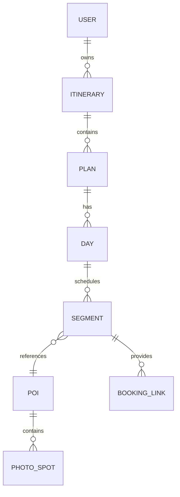

# trip_xuxiake

徐霞客 AI 旅行助手是一个面向「规划—预订—出行」全流程的旅行软件原型。当前仓库提供无后端依赖的 Web MVP：用户可输入出发地、目的地、预算、天数和旅行偏好，生成 3 套行程方案，横向切换比较后保存到「我的行程」，并继续编辑地点顺序、删除/新增行程项、查看预订链接和启动旅中导航翻译助手。

## 已实现功能

- **行程规划**：支持出发地、目的地、天数、预算、偏好输入，基于本地规则引擎生成 3 套差异化方案（松弛度假、奇观打卡、文化深度）。
- **多方案切换**：方案区使用横向滚动 Carousel 和 Tab 按钮，可模拟移动端左右滑切换。
- **圆周旅迹式行程卡片**：每套方案按天拆分，展示交通、景点、美食、住宿等卡片，并附带拍照点和游览重点。
- **我的行程**：确认方案后保存到 localStorage；可展开详情、删除行程、手动新增地点、删除地点、上移/下移调整顺序。
- **预订链接**：交通、住宿、景点、餐饮卡片均关联官方或 OTA 检索链接，后续可替换为真实合作链接、深链和交易 ID。
- **旅中导航与翻译**：点击「开始游览」后展示当前位置到下一站的路线建议、拍照出片点位和中英日常用问路短句。
- **合规策略提示**：页面明确说明小红书/抖音/携程攻略内容不做未授权爬取，应使用官方 API、商务授权、达人合作或用户主动导入。

## 快速开始

```bash
npm start
```

随后打开 <http://localhost:4173>。

> 本项目不需要安装 npm 依赖；`npm start` 仅调用 Python 静态文件服务器。

## 本地检查

```bash
npm run check
```

该命令使用 `node --check app.js` 做 JavaScript 语法检查。

## 产品与技术方案

### MVP 数据模型



- `User`：用户 ID、偏好标签、账户信息、设备标识、隐私设置。
- `Itinerary`：行程 ID、所属用户、标题、起止日期、生成时间、版本号。
- `Plan`：2～3 套备选方案，包含预算、风格、行程天数、方案状态。
- `Day`：单日行程，包含多个 `Segment`。
- `Segment`：交通、景点、美食、住宿、休息等行程项。
- `POI`：地点名称、类别、经纬度、开放时间、门票、官方链接。
- `PhotoSpot`：拍照点位、经纬度、机位提示、来源、更新时间、审核状态。
- `BookingLink`：官方或 OTA 预订链接、供应商、交易 ID、价格更新时间。

### 后续 API 设计

| Method | Endpoint | 说明 |
| --- | --- | --- |
| `GET` | `/api/itineraries?user_id=1234` | 返回用户全部行程 |
| `POST` | `/api/itineraries` | 根据目的地、预算、天数、偏好生成多方案行程 |
| `PUT` | `/api/itineraries/{id}/plan` | 确认某个方案为当前行程版本 |
| `POST` | `/api/itineraries/{id}/segments` | 增加、替换或重新排序行程地点 |
| `GET` | `/api/pois/search?query=故宫&city=北京` | 搜索景点、酒店、餐厅等 POI |
| `GET` | `/api/poi/{poi_id}` | 查询景点详情、开放时间、票价、拍照点 |
| `GET` | `/api/navigation/route?origin=lat,lng&dest=lat,lng` | 封装地图 SDK 或 OSRM 的路线规划 |
| `GET` | `/api/translate?text=你好&to=en` | 文本、语音或图片翻译 |
| `POST` | `/api/sync/itineraries` | 多端同步与冲突合并 |

### 合规攻略数据接入

不建议也不实现绕过平台限制的爬虫。可行路径：

1. **官方 API / 开放平台**：接入携程、地图、景区、航司、酒店集团等官方接口。
2. **商务授权内容源**：与小红书、抖音、达人 MCN 或内容服务商合作获取授权攻略。
3. **用户主动导入**：允许用户粘贴攻略链接或笔记文本，并在用户授权范围内做结构化摘要。
4. **来源与置信度**：每个拍照点和行程建议记录来源、采集方式、更新时间、审核状态和可信度。
5. **人工审核闭环**：高热度 POI、门票、闭园、交通变更等信息进入人工审核和过期提醒队列。

### 里程碑建议

1. **第 1 个月：MVP**
   - 完成行程输入、多方案生成、方案卡片、保存与基础编辑。
2. **第 2～3 个月：预订与分享**
   - 接入 OTA/官方预订链接、价格跟踪、日历/PDF 导出、社交分享。
3. **第 4～5 个月：导航与拍照点**
   - 接入地图路线、定位、离线缓存、授权攻略拍照点位。
4. **第 6 个月：翻译与安全审计**
   - 增加语音/图片翻译、多语言 UI、加密同步、数据删除和隐私审计。

## 文件结构

```text
.
├── app.js        # 本地规则引擎、方案生成、保存编辑、旅中助手交互
├── index.html    # 页面结构和产品信息
├── styles.css    # 响应式卡片 UI 与移动端交互样式
├── package.json  # 本地启动和检查脚本
└── README.md     # 产品说明、API 设计与合规策略
```
